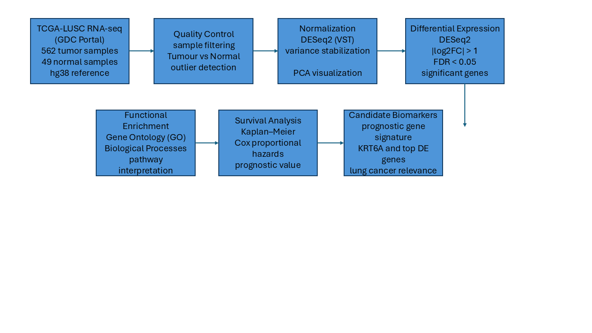
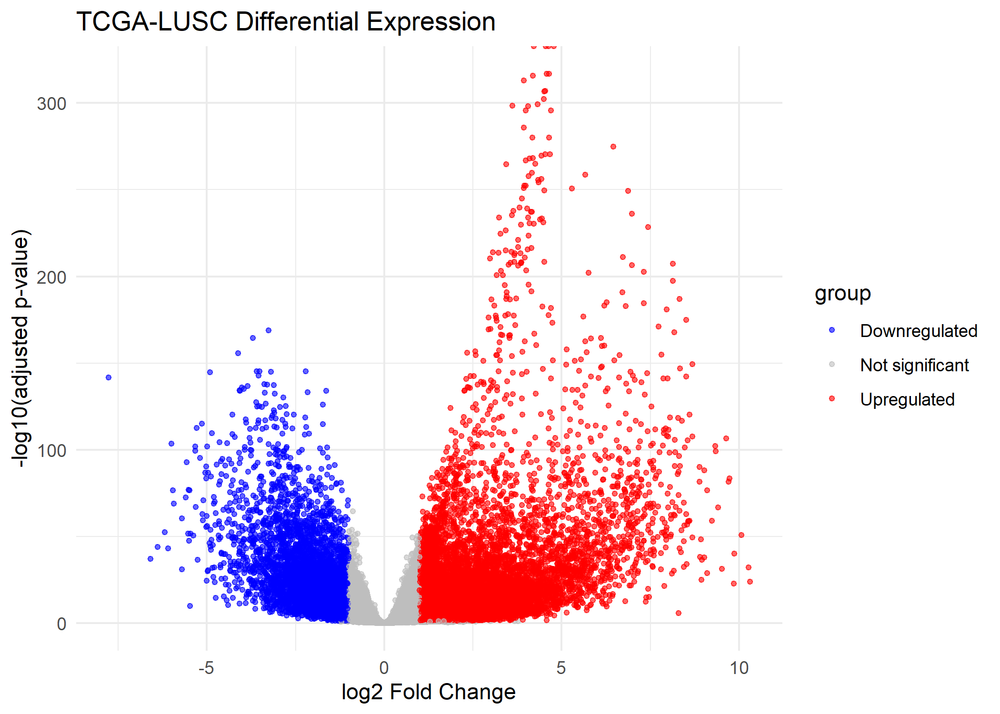
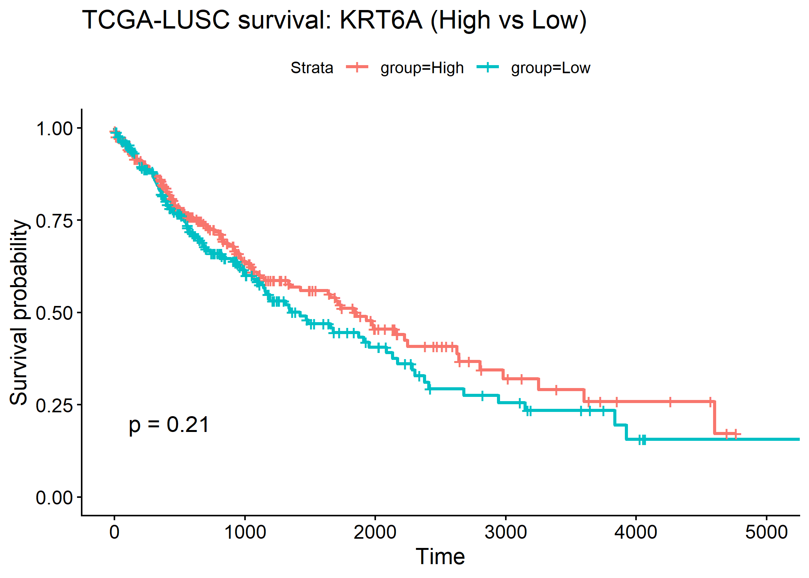
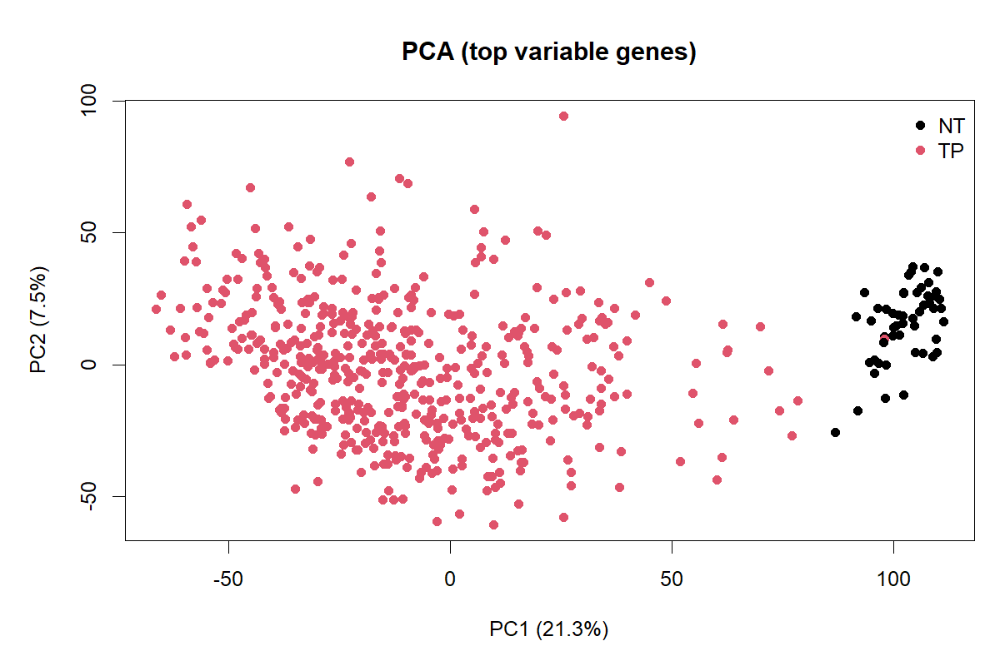
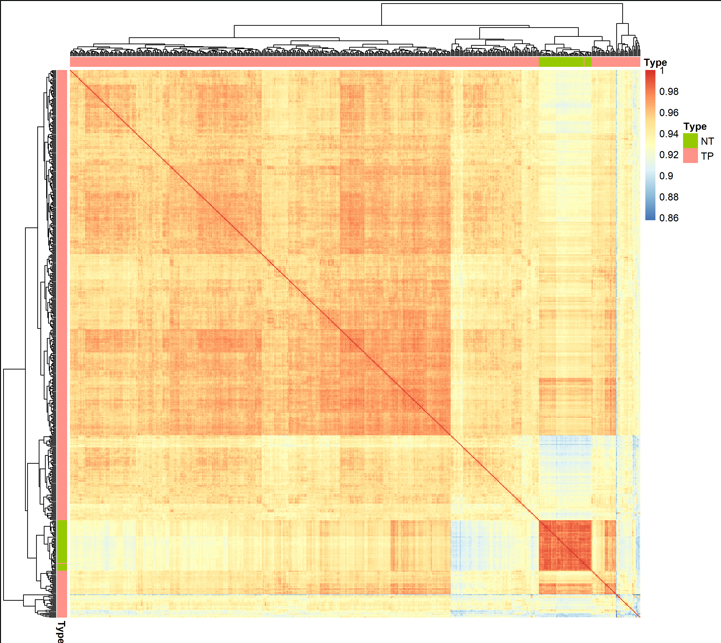
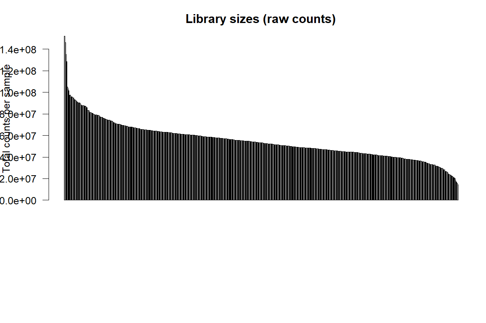

# TCGA Lung Squamous Cell Carcinoma (LUSC) RNA-seq Biomarker Discovery

## Analysis Workflow

## HTML
<p align="center">
  
</p>

## Project Overview

Lung cancer is one of the leading causes of cancer mortality worldwide.
Lung Squamous Cell Carcinoma (LUSC) is a major histological subtype characterized by extensive transcriptional reprogramming and strong tumor–immune interactions.

This project performs a **reproducible bioinformatics analysis of TCGA-LUSC bulk RNA-seq data** to identify genes and biological processes associated with tumor development and potential diagnostic or prognostic biomarkers.

The analysis compares **tumor (TP)** and **normal lung tissue (NT)** samples and links gene expression patterns to biological function and clinical relevance.

---
## Dataset

Source: The Cancer Genome Atlas (TCGA)

| Attribute      | Value                               |
| -------------- | ----------------------------------- |
| Cohort         | TCGA-LUSC                           |
| Data type      | Bulk RNA-seq gene expression counts |
| Tumor samples  | 511                                 |
| Normal samples | 51                                  |
| Genes analyzed | ~60,000                             |

Data were downloaded programmatically using the `TCGAbiolinks` R package.

---

## Analysis Workflow

The analysis pipeline was implemented entirely in R and follows a standard cancer transcriptomics workflow:

1. Download RNA-seq counts from TCGA (TCGAbiolinks)
2. Metadata filtering (Tumor vs Normal)
3. Quality control and library size assessment
4. Variance Stabilizing Transformation (DESeq2 VST)
5. Principal Component Analysis (PCA)
6. Differential Gene Expression (DESeq2)
7. Multiple testing correction (FDR)
8. Visualization (volcano plots & heatmaps)
9. Functional enrichment analysis (Gene Ontology)
10. Survival analysis for clinically relevant genes

---

## Key Results

### Tumor vs Normal Separation (PCA)


PCA demonstrates clear separation between tumor and normal lung samples, indicating widespread transcriptomic alterations in LUSC.

---


### Differential Gene Expression



Thousands of genes are significantly differentially expressed (FDR-corrected), consistent with major molecular reprogramming in cancer tissue.

---

### Tumor Gene Signature


A subset of highly variable genes strongly discriminates tumor from normal samples, suggesting potential diagnostic biomarkers.

---

## Markdown

## Survival Analysis


High expression of **KRT6A** stratifies TCGA-LUSC patients into different survival groups (Kaplan–Meier, log-rank p-value shown).

---

## Functional Interpretation

Gene Ontology enrichment revealed biological programs characteristic of squamous tumors:

* keratinization
* epidermis development
* epithelial cell differentiation
* immune activation pathways

These findings align with the known histopathology of lung squamous cell carcinoma and indicate strong immune involvement in the tumor microenvironment.

---

## Clinical Relevance

Survival analysis was performed to evaluate whether expression of selected genes is associated with patient outcome.
Several tumor-associated genes showed differential survival patterns, suggesting potential **prognostic biomarker candidates**.

---

## Quality Control

Detailed QC report:
`reports/qc_report.md`

Included checks:

* library size distribution
* PCA clustering
* sample–sample correlation

QC plots:

**PCA (QC)**


**Sample correlation**


**Library sizes**


---

## Repository Structure

```
scripts/   → analysis scripts (R)
figures/   → generated plots
results/   → differential expression tables
reports/   → QC report
```

Main output:
`results/DE_genes_LUSC.csv`
(FDR-corrected differential expression results)

---

## Reproducibility

All analyses can be reproduced from raw TCGA data using a single command in R:

```r
source("run_analysis.R")
```

The pipeline automatically:

* downloads TCGA-LUSC RNA-seq data
* performs quality control
* computes PCA
* identifies differentially expressed genes
* generates visualizations
* performs Gene Ontology enrichment
* runs survival analysis

Software versions are recorded in `session_info.txt`.


### Run the analysis

From the project root:

```r
source("run_analysis.R")
```

The pipeline will automatically download TCGA data and reproduce the analysis.

---

## Skills Demonstrated

This project demonstrates practical skills in:

* RNA-seq data analysis
* statistical modeling (DESeq2)
* data visualization
* cancer genomics
* functional enrichment analysis
* clinical survival analysis
* reproducible research workflows
