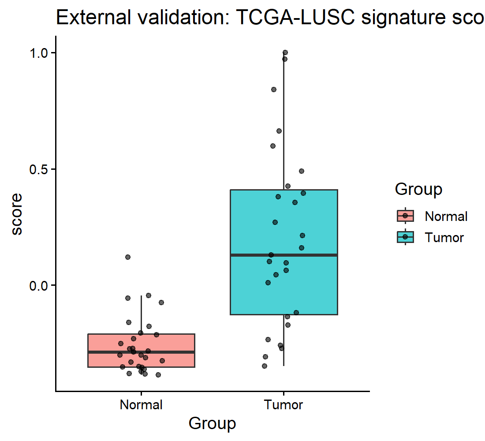

# TCGA Lung Squamous Cell Carcinoma (LUSC) RNA-seq Biomarker Discovery

A fully reproducible bioinformatics pipeline for discovery and validation of prognostic biomarkers in lung cancer using TCGA bulk RNA-seq data.

The project identifies tumor-specific transcriptional programs in lung squamous cell carcinoma (LUSC) and demonstrates that a derived multi-gene expression signature predicts overall survival in TCGA patients.

---

## Analysis Workflow

This repository is designed so the entire analysis can be reproduced from raw TCGA data using a single R command.

---

## Project Overview

Lung cancer is one of the leading causes of cancer-related mortality worldwide.  
**Lung Squamous Cell Carcinoma (LUSC)** is a major histological subtype characterized by strong transcriptional dysregulation and tumor–immune interactions.

This project performs a **reproducible transcriptomic analysis of TCGA-LUSC RNA-seq data** to:

- identify genes differentially expressed between tumor and normal lung tissue
- interpret affected biological pathways (Gene Ontology)
- evaluate clinical relevance using survival analysis
- propose candidate diagnostic / prognostic biomarkers

The analysis compares **primary tumor samples (TP)** vs **normal tissue samples (NT)**.

---

## Dataset

Source: **The Cancer Genome Atlas (TCGA)**

| Attribute | Value |
|---|---|
| Cohort | TCGA-LUSC |
| Data type | Bulk RNA-seq gene expression counts |
| Tumor samples | 511 |
| Normal samples | 51 |
| Genes analyzed | ~60,000 |

Data are downloaded programmatically using the `TCGAbiolinks` R package.

---
## Repository Structure

scripts/   -> analysis scripts (R)
figures/   -> generated plots
results/   -> result tables (e.g., DE genes)
reports/   -> QC report (markdown)
run_analysis.R -> one-command full pipeline

Main result file (if saved): `results/DE_genes_LUSC.csv` (FDR-corrected DE results)

---

## Key Results

### Tumor vs Normal Separation (PCA)

Principal Component Analysis shows clear separation between tumor and normal lung samples, indicating widespread transcriptomic reprogramming in LUSC.

---

### Differential Gene Expression

Thousands of genes are significantly differentially expressed (FDR-corrected), consistent with major molecular alterations in tumor tissue.

---

### Survival Analysis (example gene)

High expression of **KRT6A** stratifies TCGA-LUSC patients into different survival groups (Kaplan–Meier; log-rank p-value shown), suggesting potential prognostic relevance.
---

### Prognostic Gene Signature

A multi-gene transcriptional signature derived from tumor vs normal differential expression significantly stratifies TCGA-LUSC patients into survival groups (Cox HR ≈ 0.75, p < 0.05).
---
## Tumor Gene Signature
Differential expression analysis of TCGA-LUSC RNA-seq data identified a reproducible transcriptional program distinguishing tumor from normal lung tissue.

A large proportion of the top upregulated genes belonged to the Cancer-Testis Antigen (CTA) family, including MAGEA3, MAGEA4, MAGEA9, MAGEA10, MAGEA11, MAGEB1, and MAGEB2.
CTAs are normally restricted to germline tissues but become aberrantly activated in tumors due to epigenetic dysregulation and are well-known immunotherapy targets. Their recovery from an unbiased bulk RNA-seq analysis indicates that the computational pipeline captures biologically meaningful tumor signals.

In parallel, multiple epithelial differentiation markers (keratinization and squamous lineage genes) were detected, consistent with the known histopathology of lung squamous cell carcinoma.

The convergence of:

Cancer-Testis Antigen activation

epithelial differentiation programs

tumor–normal transcriptomic separation

demonstrates that transcriptome-level analysis alone can recover canonical molecular features of LUSC.

The heatmap shows z-score scaled expression of the most variable significantly differentially expressed genes across selected tumor (TP) and normal (NT) samples.

Genes were selected using:

adjusted p-value (FDR) < 0.05

ranked by log2 fold-change

The resulting candidate biomarker panel is provided here: results/top_LUSC_signature_genes.csv

This gene set represents a candidate transcriptional signature capable of distinguishing LUSC tumors from normal lung tissue and provides potential targets for diagnostic and immunotherapeutic investigation.

---

## External validation (GEO – GSE33479)

To assess whether the TCGA-derived signature generalizes beyond TCGA, we validated it in an independent GEO microarray cohort (**GSE33479**).

**PCA using signature genes**  

**Signature score / expression differences**  

Reproducible script: reports/08_external_validation_GEO.R

---
Prognostic Gene Signature (TCGA-LUSC)

To determine whether tumor transcriptional programs have clinical relevance, we constructed a multi-gene expression signature derived from significantly differentially expressed genes and evaluated its prognostic value in the TCGA-LUSC cohort.

For each patient, a signature score was computed as the mean z-score of normalized expression across signature genes. Patients were stratified into HIGH and LOW groups using the cohort median.

Kaplan–Meier survival analysis
Patients with high signature scores showed significantly improved overall survival compared to the low-score group.

Cox proportional hazards model:

Hazard Ratio (HR) ≈ 0.75

95% CI: 0.57–0.98

log-rank p ≈ 0.036

This indicates the gene signature functions as a prognostic biomarker in lung squamous cell carcinoma.

Importantly, the signature is derived solely from tumor vs normal transcriptomic differences, demonstrating that tumor-specific expression programs can predict patient outcomes.

## Functional Interpretation

Gene Ontology enrichment highlights biological programs characteristic of squamous tumors:

- keratinization
- epidermis development
- epithelial cell differentiation
- immune activation pathways

These results align with known LUSC biology and tumor microenvironment involvement.

---

## Quality Control

Detailed QC report: `reports/qc_report.md`

QC plots:

**QC PCA**  

**Sample correlation**  

**Library sizes**  

---

## Reproducibility

Run the entire pipeline from the project root:
source("run_analysis.R")

The pipeline automatically:

downloads TCGA-LUSC RNA-seq data

performs quality control

computes PCA

identifies differentially expressed genes

generates figures

performs Gene Ontology enrichment

runs survival analysis

Software versions are recorded in session_info.txt.

---

## Methods and Techniques

RNA-seq differential expression analysis (DESeq2)
TCGA data acquisition (TCGAbiolinks)
Gene Ontology enrichment analysis
Kaplan–Meier survival modeling
Cox proportional hazards regression
Prognostic biomarker construction
External dataset validation (GEO)
Transcriptomic data visualization (ggplot2, pheatmap)
Reproducible bioinformatics workflows

---
## Use the tumor signature on your own dataset

You can compute the TCGA-LUSC signature score on any RNA-seq dataset:

source("scripts/predict_signature_score.R")

score <- predict_signature_score(expression_matrix, signature_genes)

---

## Author

Agata Gabara
Bioinformatics / Computational Biology
