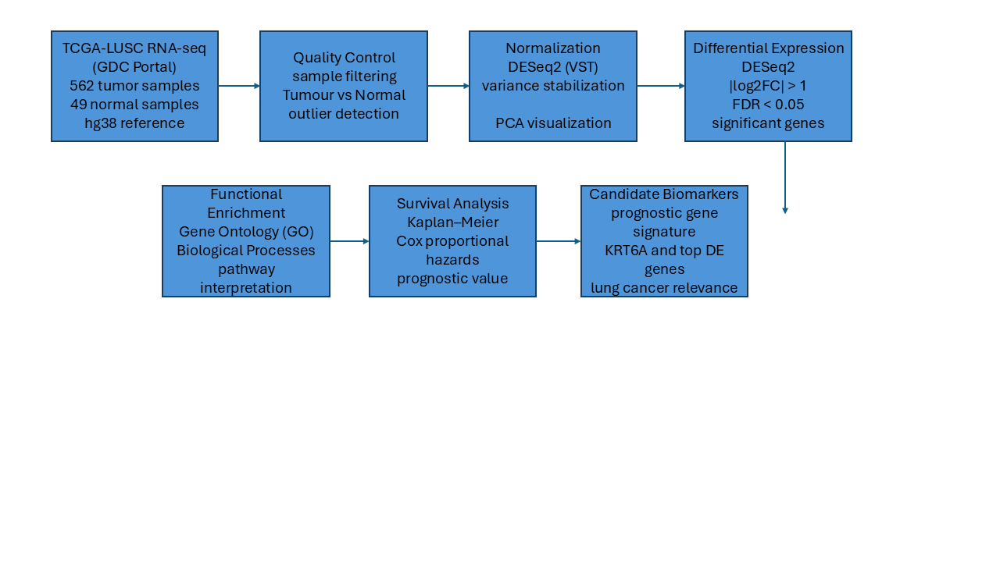
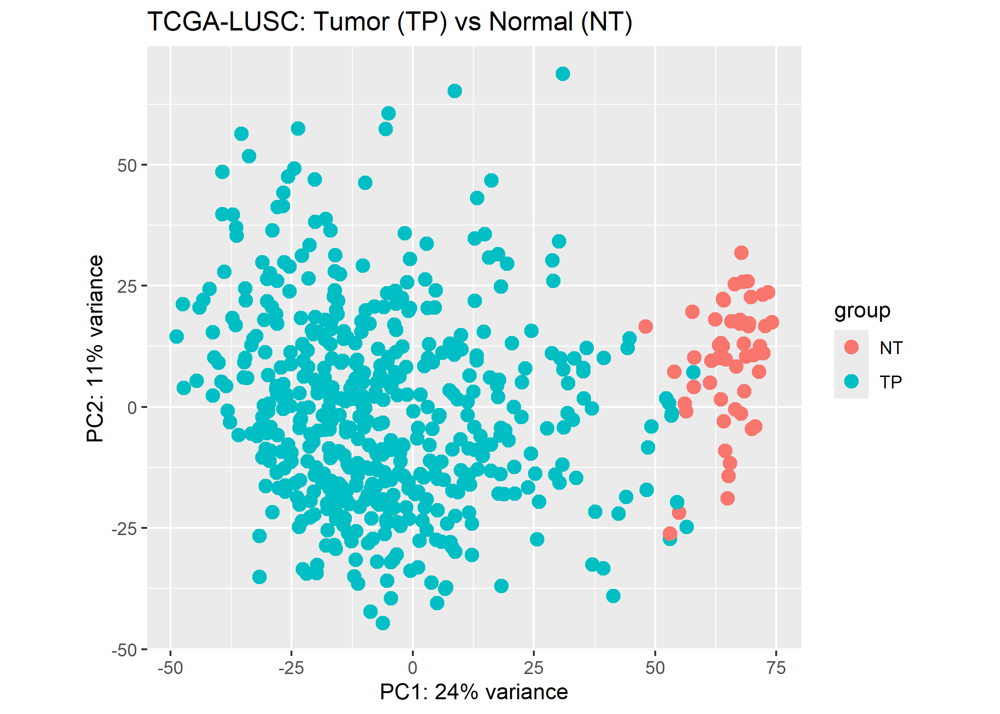
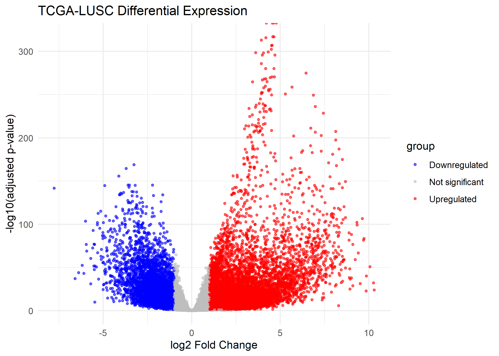
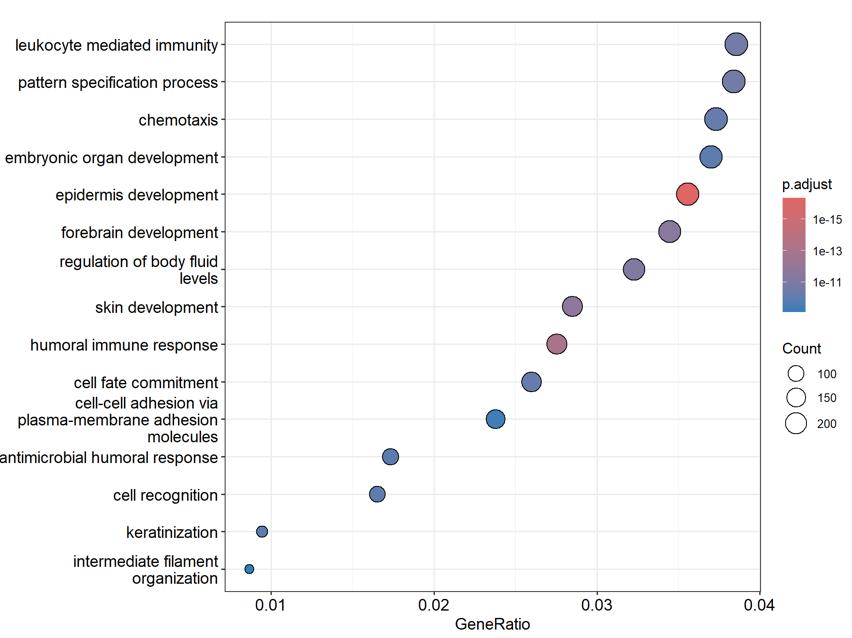
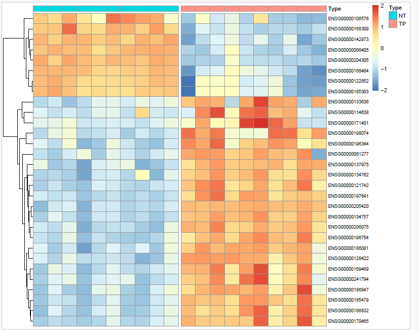
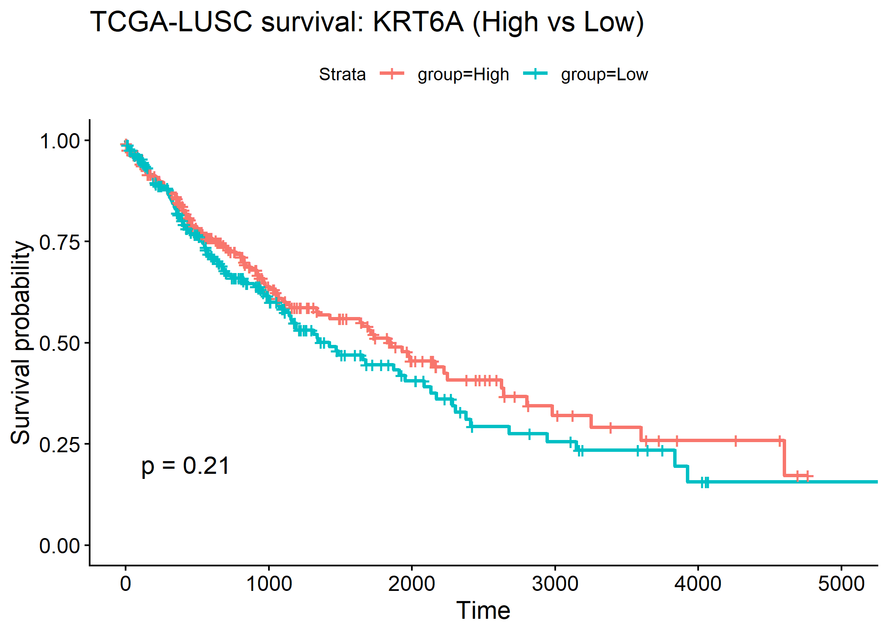
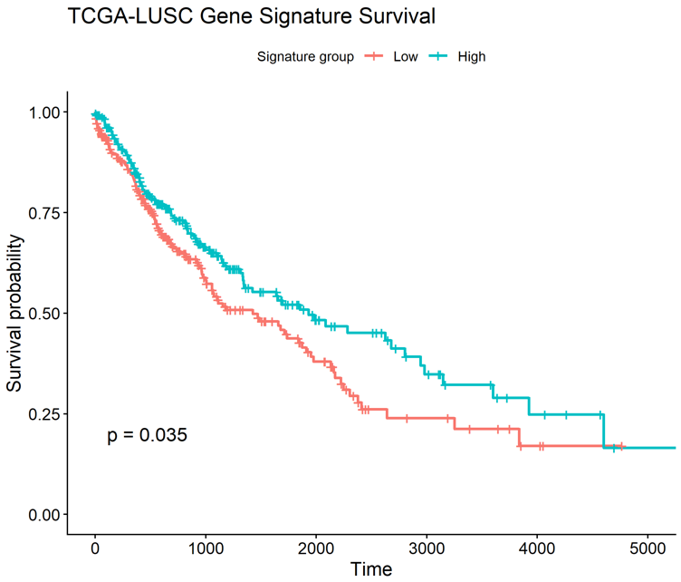
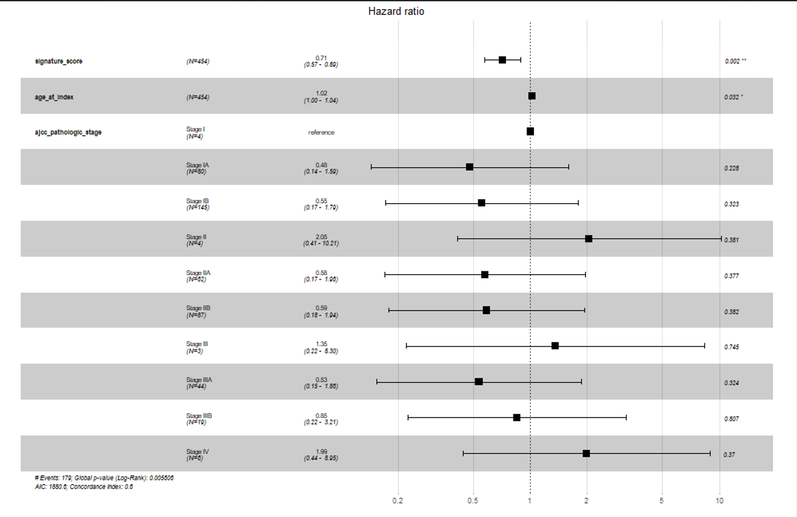
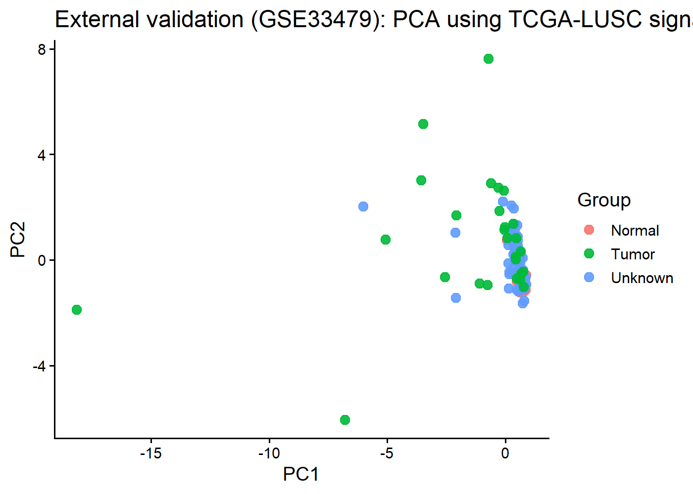
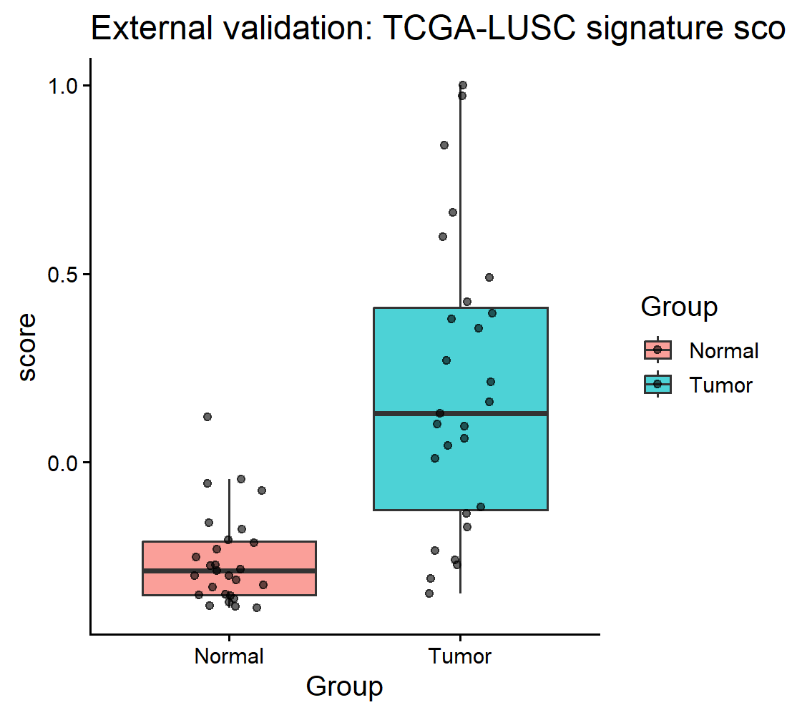

# TCGA Lung Squamous Cell Carcinoma (LUSC) RNA-seq Biomarker Discovery

A fully reproducible cancer genomics workflow for transcriptomic biomarker discovery in lung squamous cell carcinoma (LUSC) using TCGA RNA-seq data.

The project performs differential expression analysis, pathway enrichment, prognostic biomarker discovery, survival modeling, and external validation to identify biologically and clinically relevant transcriptional signatures associated with LUSC.

---

## Project Highlights

✔ TCGA-LUSC RNA-seq analysis

✔ Automated TCGA data download using TCGAbiolinks

✔ Differential expression analysis with DESeq2

✔ Gene Ontology (GO) enrichment analysis

✔ KEGG pathway enrichment analysis

✔ Prognostic biomarker discovery

✔ Kaplan–Meier survival analysis

✔ Multivariate Cox regression

✔ External validation using GEO datasets

✔ Fully reproducible end-to-end workflow

---

## Project Overview

Lung Squamous Cell Carcinoma (LUSC) is a major subtype of non-small cell lung cancer characterized by extensive transcriptomic dysregulation and complex tumor–immune interactions.

This project performs a reproducible transcriptomic analysis of TCGA-LUSC RNA-seq data to:

- Identify differentially expressed genes between tumor and normal tissue
- Characterize biological pathways altered in LUSC
- Construct a transcriptome-derived prognostic signature
- Evaluate clinical relevance using survival analysis
- Validate findings in independent GEO cohorts

---

## Dataset

**Source:** The Cancer Genome Atlas (TCGA)

| Attribute | Value |
|------------|------------|
| Cohort | TCGA-LUSC |
| Data Type | Bulk RNA-seq |
| Tumor Samples | 511 |
| Normal Samples | 51 |
| Genes Analyzed | ~60,000 |

Data are downloaded programmatically using the `TCGAbiolinks` package.

---

## Analysis Workflow



The entire analysis can be reproduced from raw TCGA data using a single R command.

---

## Key Results

### Tumor vs Normal Separation



Principal Component Analysis demonstrated clear separation between tumor and normal lung tissue samples, indicating extensive transcriptomic reprogramming in LUSC.

---

### Differential Gene Expression



Thousands of genes were significantly dysregulated following FDR correction, reflecting major molecular alterations in tumor tissue.

---

### Gene Ontology Enrichment



GO enrichment identified pathways associated with:

- Epidermis development
- Keratinization
- Keratinocyte differentiation
- Epithelial cell differentiation
- Leukocyte-mediated immunity
- Humoral immune response

These findings capture both squamous differentiation and tumor–immune microenvironment biology.

---

### KEGG Pathway Enrichment


KEGG analysis highlighted enrichment of:

- Cytokine-cytokine receptor interaction
- ECM-receptor interaction
- Cell adhesion molecules
- Complement and coagulation cascades
- Hematopoietic cell lineage
- Neutrophil extracellular trap formation

---

### Tumor Gene Signature



Differential expression analysis identified a reproducible transcriptional program distinguishing tumor from normal tissue.

Prominent features included:

- MAGEA3
- MAGEA4
- MAGEA9
- MAGEA10
- MAGEA11

Together with additional squamous differentiation and immune-related genes, these markers capture canonical molecular features of LUSC.

---

### Survival Analysis



High expression of KRT6A significantly stratified patient survival, suggesting potential prognostic relevance.

---

### Prognostic Gene Signature



A multi-gene transcriptomic signature significantly separated patients into distinct survival groups.

Key findings:

- Significant Kaplan–Meier separation
- Independent prognostic value
- Retained significance after adjustment for age and pathological stage

---

### Multivariate Cox Regression



The transcriptomic signature remained a significant predictor of overall survival after adjustment for clinical covariates.

Model performance:

- Concordance Index (C-index): ~0.60
- Significant likelihood ratio test
- Significant log-rank test

---

### External Validation (GEO)

#### PCA Using Signature Genes



#### Signature Score Comparison



The TCGA-derived signature was validated in the independent GEO cohort GSE33479, demonstrating reproducibility across datasets.

---

## Potential Clinical and Research Applications

This project demonstrates how transcriptomic profiling can be used for:

- Cancer biomarker discovery
- Risk stratification
- Precision oncology research
- Immunotherapy target identification
- Translational cancer research
- External biomarker validation
- Reproducible cancer genomics workflows

Importantly, the identified biomarkers are research findings and are not clinically validated diagnostic tools.

---

## Repository Structure

```text
tcga-lusc-biomarker-analysis/
│
├── data/
│
├── figures/
│
├── results/
│
├── scripts/
│
├── reports/
│
├── run_analysis.R
│
├── session_info.txt
│
└── README.md
```

---

## Methods and Techniques

- RNA-seq differential expression analysis (DESeq2)
- TCGA data acquisition (TCGAbiolinks)
- Gene Ontology enrichment analysis
- KEGG pathway enrichment analysis
- Kaplan–Meier survival modeling
- Cox proportional hazards regression
- Prognostic biomarker construction
- GEO external validation
- Transcriptomic visualization
- Reproducible bioinformatics workflows

---

## Reproducibility

### Requirements

- R ≥ 4.2
- RStudio (recommended)
- Internet connection

### Installation

```bash
git clone https://github.com/ag48665/tcga-lusc-biomarker-analysis.git

cd tcga-lusc-biomarker-analysis
```

### Run Analysis

```r
source("run_analysis.R")
```

The pipeline automatically:

- Downloads TCGA-LUSC data
- Performs quality control
- Computes PCA
- Performs DESeq2 analysis
- Runs GO and KEGG enrichment
- Builds prognostic signatures
- Performs survival analyses
- Generates all figures

---

## Data Availability

All data are publicly available through:

- TCGA / GDC
- GEO

No new human subjects were recruited and no ethical approval was required.

---

## License

This repository is provided for educational, research, and portfolio purposes.

---

## Author

**Agata Gabara**

MSc Bioinformatics Student

Research Interests:

- Cancer Genomics
- Transcriptomics
- Computational Biology
- Biomarker Discovery
- Clinical Bioinformatics
- Multi-Omics Integration

GitHub: https://github.com/ag48665

LinkedIn: https://www.linkedin.com/in/agatha-gabara-06494a37/
