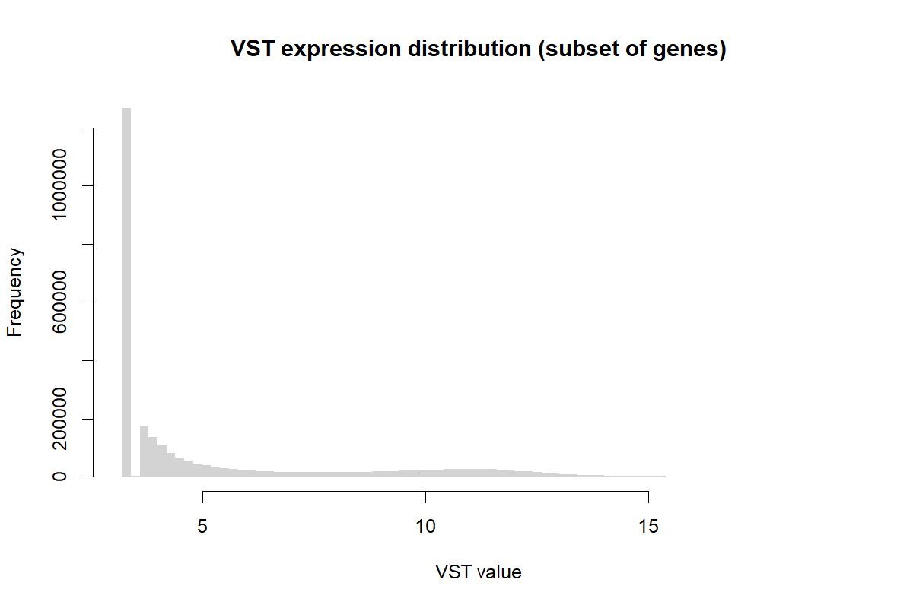

# QC Report (TCGA-LUSC RNA-seq)

## Summary
- Samples (total): **562**
- Genes (VST matrix): **60660**

## Sample counts by Type
- TP: 511 | NT: 51

## Plots

### Library sizes (raw counts)

### VST distribution

### PCA (top variable genes)

### Sample correlation heatmap

